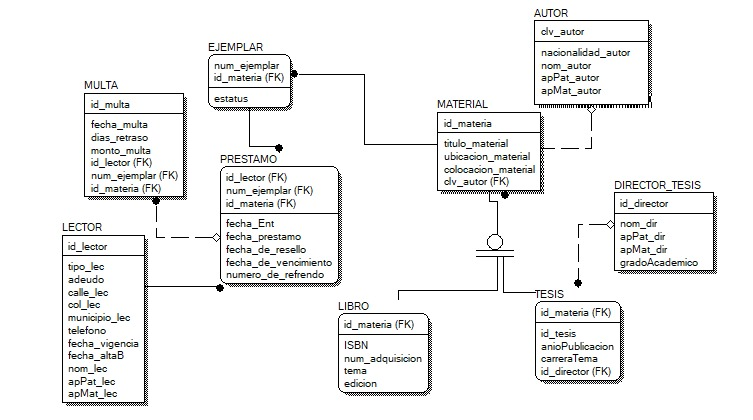

# Diccionario de Datos de la Biblioteca

## Diagrama de la base de datos

## Lector

- **ID_lector**: Identificador del lector (CHAR(5), PRIMARY KEY).
- **nombre_lec**: Nombre completo del lector.
- **apPat_lec**: Apellido paterno del lector.
- **apMat_lec**: Apellido materno del lector (puede ser nulo).
- **tipo_lector**: Tipo de lector ('Estudiante', 'Profesor', 'Investigador').
- **adeudo**: Monto adeudado por el lector (NUMBER(6,2), por defecto NULL).
- **calle_lec**: Calle de la dirección del lector.
- **colonia_lec**: Colonia de la dirección del lector.
- **municipio_lec**: Municipio de la dirección del lector.
- **telefono_lec**: Número de teléfono del lector.
- **fecha_alta**: Fecha en la que el lector se dio de alta en la biblioteca (DATE, por defecto la fecha actual del sistema).
- **fechavigencia**: Fecha de vigencia (un año después de la fecha de alta).

## Autor

- **ID_autor**: Identificador del autor (CHAR(5), PRIMARY KEY).
- **nombre_autor**: Nombre completo del autor.
- **apPat_autor**: Apellido paterno del autor.
- **apMat_autor**: Apellido materno del autor (puede ser nulo).
- **nacionalidad_autor**: Nacionalidad del autor.

## Material

- **ID_material**: Identificador del material (CHAR(5), PRIMARY KEY).
- **titulo_material**: Título del material.
- **colocacion_material**: Colocación del material en la biblioteca.
- **ubicacionEnBiblioteca**: Ubicación del material dentro de la biblioteca.
- **ID_autor**: Identificador del autor del material (FOREIGN KEY REFERENCES Autor(ID_autor)).

## Ejemplar

- **ID_ejemplar**: Identificador del ejemplar (CHAR(5), PRIMARY KEY).
- **num_ejemplar**: Número del ejemplar.
- **ID_material**: Identificador del material al que pertenece el ejemplar (FOREIGN KEY REFERENCES Material(ID_material)).
- **Estatus**: Estado del ejemplar ('Disponible', 'Prestado', 'Mantenimiento', 'No Prestable').

## PrestamoBiblioteca

- **ID_prestamo**: Identificador del préstamo (CHAR(5), PRIMARY KEY).
- **ID_lector**: Identificador del lector que realizó el préstamo (FOREIGN KEY REFERENCES Lector(ID_lector)).
- **ID_ejemplar**: Identificador del ejemplar prestado (FOREIGN KEY REFERENCES Ejemplar(ID_ejemplar)).
- **ID_material**: Identificador del material prestado (FOREIGN KEY REFERENCES Material(ID_material)).
- **fecha_prestamo**: Fecha en la que se realizó el préstamo (DATE, por defecto la fecha actual del sistema).
- **fecha_Entrega**: Fecha en la que se entregó el ejemplar (por defecto NULL).
- **fecha_Resello**: Fecha en la que se realizó el resello del ejemplar (por defecto NULL).
- **fecha_vencimiento**: Fecha en la que vence el préstamo (por defecto NULL).
- **Numero_Refrendo**: Número de refrendo (1, 2, 3).

## Multa

- **ID_multa**: Identificador de la multa (CHAR(5), PRIMARY KEY).
- **fecha_multa**: Fecha en la que se registró la multa (DATE, por defecto la fecha actual del sistema).
- **dias_retraso**: Número de días de retraso en la devolución del ejemplar.
- **monto_multa**: Monto de la multa.
- **ID_prestamo**: Identificador del préstamo al que pertenece la multa (FOREIGN KEY REFERENCES PrestamoBiblioteca(ID_prestamo)).

## Director_Tesis

- **ID_director**: Identificador del director de tesis (CHAR(5), PRIMARY KEY).
- **nombre_director**: Nombre completo del director de tesis.
- **apPat_director**: Apellido paterno del director de tesis.
- **apMat_director**: Apellido materno del director de tesis (puede ser nulo).
- **grado_Academico**: Grado académico del director de tesis.

## Tesis

- **ID_material**: Identificador del material de la tesis (CHAR(5), PRIMARY KEY, FOREIGN KEY REFERENCES Material(ID_material)).
- **ID_tesis**: Identificador de la tesis.
- **anioPublicacion**: Año de publicación de la tesis.
- **Carrera_Tema**: Carrera del tema de la tesis.
- **ID_director**: Identificador del director de tesis (FOREIGN KEY REFERENCES Director_Tesis(ID_director)).

## LibroBiblioteca

- **ID_material**: Identificador del material del libro (CHAR(5), PRIMARY KEY, FOREIGN KEY REFERENCES Material(ID_material)).
- **ISBN**: Número de ISBN del libro.
- **NUM_Adquisicion**: Número de adquisición del libro.
- **carrera_tema**: Carrera del tema del libro.
- **edicion**: Número de edición del libro.
